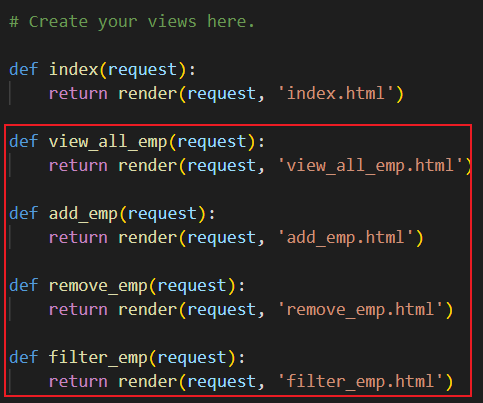

# Office Employee Management System

> ### Show All Commands
> django-admin

> ### To Run A Project 
> 1. Create a project
> 2. `cd` till manage.py file on VS terminal `(Ex. "cd office_emp_proj")`
> 3. Run `python manage.py runserver`
> 4. Open URL: http://127.0.0.1:8000/ in browser

> ### Steps To Start/Create A Django Project
>> ### Step 1: Create a project
>> `django-admin startproject office_emp_proj`
> 
>> ### Step2: Create app (emp_app) to handle all employee's
>> 1. `python manage.py startapp emp_app`
>> 2. Add app(emp_app) in "office_emp_proj\settings.py" > INSTALLED_APPS ('emp_app',)
>> 3. Include app urls in "office_emp_proj\urls.py"
>> 
>> 5. Create urls.py file for app(emp_app), then import views & add function/view
>> 
>> 6. Create function/view (index) in "emp_app\views.py" (So that function can route)
>> 7. Create template folder in app & add your templates (Ex. index.html)
>> 8. Then render the template in function/view (file: "emp_app\views.py")
>> 
>> 9. Run the project
>>> **Summary:** 
>>> 1. When Django server is started, `manage.py` file searches for `settings.py` file which contains information of all the applications, databases and path to the main urls config.
>>> 2. Django first determines and loads the requested `module/app urls` then check each URL pattern in apps `urls.py` file.
>>> 3. Django then imports and calls the given `view` from `views.py` file.
>>> 4. In case none of the URLs match the requested URL, Django invokes an error-handling view.
>>> 5. If URL maps, a view is called that interacts with `model and template`, it renders a `template`.
>>> 6. Django sends a `template` as a response to the user.
>>> 
>
>> ### Step3: Create model
>> 1. Create tables in `models.py` file
>> 
>> 2. Create migration file inside the migration folder:
>>  `python manage.py makemigrations`
>> 3. After creating a migration, to reflect changes in the database permanently execute migrate command:
>>  `python manage.py migrate`
>> 4. `(Optional but useful)` Register model in `emp_app\admin.py` to detect changes.
>> 
>> 5. Create `superuser` to access admin portal
>>   `python manage.py createsuperuser`
>> 
>> 6. Access admin portal
>> - Run project. `Python manage.py runserver`
>> - Open URL: http://127.0.0.1:8000/admin in browser
>> - Login into admin portal by using superuser credentials
>> 
>> - We can directly add entries in tables from admin portal by clicking on `+ Add`
>> 
>> 7. To change the display string for entries of table in admin portal
>> - Go to `emp_app\models.py` & add `__str__` fun as below:
>> 
>> - Run `python manage.py makemigrations` command
>> - Run `python manage.py migrate` command
>> 
>>> **_Other commands for migrations:_**
>>> 

> ### Create and connect multiple templates (HTML files) in Django project
>> **Step 1:** `templates`- Create HTML files
>> 
>>
>>**Step 2:** `views.py`- Create views/functions and add requests for template files
>> 
>>
>>**Step 3:** `urls.py`- Register views/functions and create paths
>> 
>>
>>**Step 4:** `index.html`- add url paths as href
>> 
>>  `URL: http://127.0.0.1:8000/view_all_emp_url`
>>  `URL: http://127.0.0.1:8000/add_emp`
>>  `URL: http://127.0.0.1:8000/remove_emp`
>>  `URL: http://127.0.0.1:8000/filter_emp`

> ### Create and connect multiple templates (HTML files) in Django project
>> **Step 1:** `views.py`- Create HTML files
>> 1. Import models
>> 2. Write query
>> 
>>
>> **Step 2:** `views_all_emp.html`- use models data as below
>> 